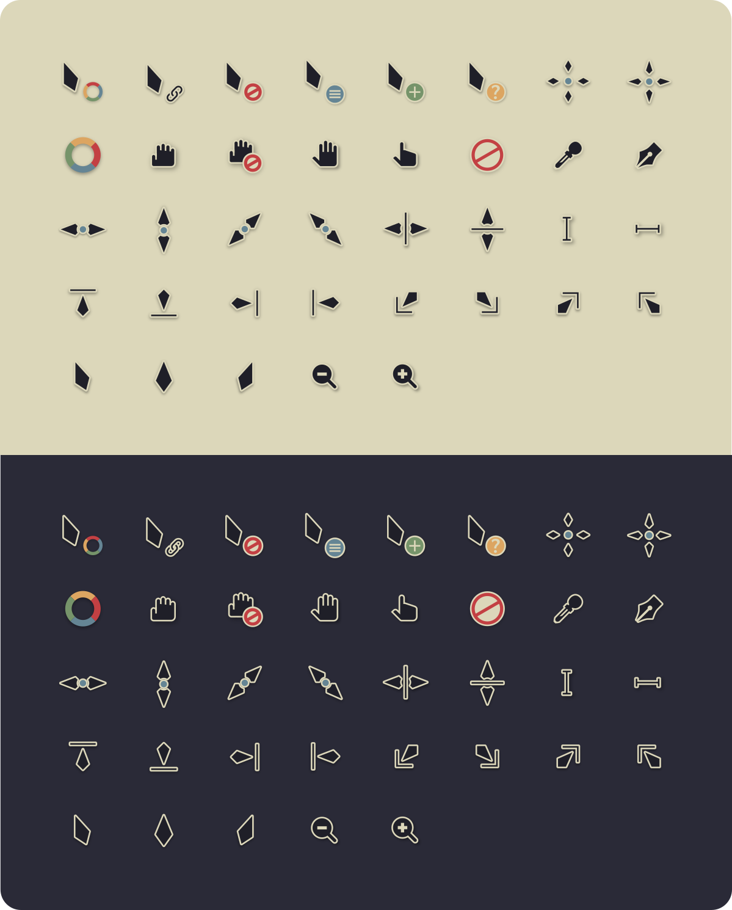
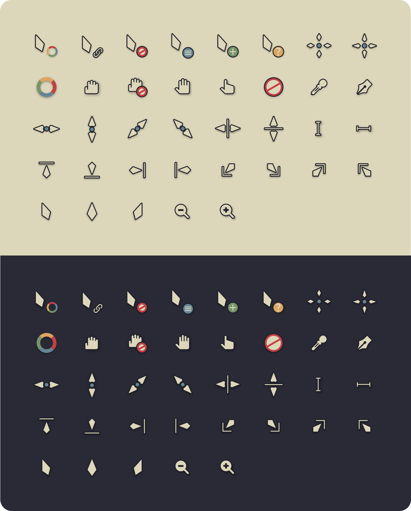

# Vimix Kanagawa cursors


This is an x-cursor, hyprcursor, and Windows cursor theme based on [Vimix cursors](https://github.com/vinceliuice/Vimix-cursors),
recoloured using the [Kanagawa colourscheme](https://github.com/rebelot/kanagawa.nvim).

## Installation

### Arch-based distros

The XCursor theme can be installed with `vimix-kanagawa-cursors` from the AUR.

The Hyprcursor theme can be installed with `vimix-kanagawa-hyprcursors` from the AUR.

Or, you can follow the instructions for [other distros](#other-distros).

### Other distros

To install the cursor theme simply copy the compiled theme to your icons directory.
For local user installation:

```sh
./install.sh <xcursor|hyprcursor|all>
```

Use `xcursor` to install xcursors only, `hyprcursor` to install hyprcursors only, or `all` for both.

XCursors can be installed system-wide for all users with `sudo`:

```sh
sudo ./install.sh xcursor
```

__Hyprcursors should not be installed system-wide due to potential permission issues.__

Once the cursors are installed, set the theme with your preferred desktop tools.

## Windows cursor installation

The Windows build comes with INF files to make installation easy.

 1. Open `windows/` folder in Explorer, open a theme folder, and right click on `install.inf`.
 1. Click 'Install' from the context menu, and authorise the modifications to your system.
 1. Press the `Windows Key and R` at the same time and type `main.cpl` in the run promt and press `Ok`.
 1. Go to `Pointers` and select `Vimix Kanagawa Cursors` under the Scheme category.
 1. Click 'Apply'.

## Building from source

You'll find everything you need to build and modify this cursor set in
the `src/` directory.

To build the xcursor theme from the SVG source run:

```sh
./build-xcursor.sh
```

This will generate the pixmaps and appropriate aliases.
The freshly compiled cursor themes will be located in `xcursor/`

To build the hyprcursor theme from the SVG source run:

```sh
./build-hyprcursor.sh
```

This will generate the SVG cursors as .hlc files and the manifest files.
The freshly compiled cursor themes will be located in `hyprcursor/`

To build the windows cursor theme from the SVG source run:

```sh
./build-windows.sh
```

This will generate the png files, convert them to .ico files, and then build them into .cur and .ani files. The freshly compiled cursor themes will be located in `windows/`

### XCursor build dependencies

- `xorg-xcursorgen`
- `python-cairosvg`

Fedora/RedHat distros:

```sh
dnf install xorg-xcursorgen python-cairosvg
```

Ubuntu/Mint/Debian distros:

```sh
sudo apt-get install xorg-xcursorgen python-cairosvg
```

ArchLinux/Manjaro:

```sh
pacman -S xorg-xcursorgen python-cairosvg
```

Other:
Search for the engines in your distributions repository or install the depends from source.

### Hyprcursor build dependencies

- `hyprcursor`

Fedora/RedHat distros:

```sh
dnf install hyprcursor
```

Ubuntu/Mint/Debian distros:

```sh
sudo apt-get install hyprcursor
```

ArchLinux/Manjaro:

```sh
pacman -S hyprcursor
```

Other:
Search for the engines in your distributions repository or install the depends from source.

### Windows cursor build dependencies

- `python-cairosvg`
- `imagemagick`
- `python`

Fedora/RedHat distros:

```sh
dnf install python-cairosvg imagemagick python3
```

Ubuntu/Mint/Debian distros:

```sh
sudo apt-get install python-cairosvg imagemagick python3
```

ArchLinux/Manjaro:

```sh
pacman -S  python-cairosvg imagemagick python
```

Other:
Search for the engines in your distributions repository or install the depends from source.

## Preview



